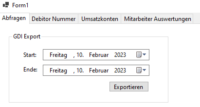

# coIT.Toolkit.Lexoffice.GdiExport

Programm um Rechnungen aus Lexware Office für den GDI-Import vorzubereiten. Enthält zusätzlich Funktionalitäten zum Abgleichen von Konten und Prüfen von Rechnungen.

## Anleitung

### Ersteinrichtung

`.msi`-Datei von [GitHub Releases](https://github.com/co-IT/coIT.Toolkit.Lexoffice.GdiExport/releases) herunterladen und installieren

Wichtig: Es muss der verschlüsselte Datenbank ConnectionString als Benutzer-Umgebungsvariable `COIT_TOOLKIT_DATABASE_CONNECTIONSTRING` zur Verfügung stehen.

### Updates

Beim Programmstart wird in den GitHub Releases automatisch nach Updates gesucht und diese installiert.

### Screenshots



## Development

### Deployment

Wenn eine neue Version released werden soll, muss nur ein neuer GitHub Release mit einem Tag im Format `x.x.x` erstellt werden.

Das Deployment startet daraufhin in einer GitHub Action durch den gepushten Tag automatisch.

Die .NET Version für den `Publish` workflow wird in der `global.json` festgelegt und muss in der Zukunft eventuell angepasst werden.

### nuget-Packages

Um die notwendigen Packages aus dem privaten Package-Manager der co-IT aus GitHub zu laden, wird eine eigene `nuget.config` benötigt.

1. Stelle sicher, dass die [GitHub Cli](https://cli.github.com/) bei dir installiert ist ([winget](https://github.com/microsoft/winget-cli))
2. Falls du bisher noch nie eine `nuget.config` anlegen musstest führe `gh auth login --scopes read:packages` aus und verknüpfge deinen GitHub Account
3. Lege eine `nuget.config` Datei mit dem folgenden Inhalt an

```
<?xml version="1.0" encoding="utf-8"?>
<configuration>
    <packageSources>
        <clear />
        <add key="nuget.org" value="https://api.nuget.org/v3/index.json" />
        <add key="github" value="https://nuget.pkg.github.com/co-IT/index.json" />
    </packageSources>
    <packageSourceCredentials>
        <github>
            <add key="Username" value="{Nutzername}" />
            <add key="ClearTextPassword" value="{Token}" />
        </github>
    </packageSourceCredentials>
</configuration>
```

4. Führe `gh api user -q ".login"` aus und ersetze `{Nutzername}` in der `nuget.config` mit dem Ergebnis
5. Führe `gh auth token` aus und ersetze `{Token}` in der `nuget.config` mit dem Ergebnis

In Zukunft, kannst du diese `nuget.config` auch für andere Tools und Projekte nutzen, die Zugriff auf den co-IT GitHub package manager benötigen und musst nicht mehr den Schritten von oben folgen
